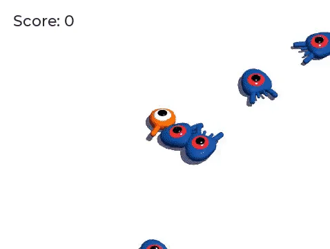

# Squash the Creeps 3D

This is my first 3D game, which I created by following the step-by-step tutorial from the [Godot Docs](https://docs.godotengine.org/en/stable/).

In this simple game, the player must dodge and jump to _squash_ enemies for as long as possible. Earning one point for each enemy squashed.

- **Engine:** Godot .NET
- **Renderer:** Forward+

## :video_game: Preview

## :computer: How to install

### Requirements

- Windows / Linux / macOS
- .NET SDK
- Godot Engine .NET

### Steps

1. Download or clone the repository.
2. Import the proyect into Godot by selecting the `project.godot` file.
3. Build and play, or export the project.

> **Note:** To export the project, you will need to have the **export templates .NET** installed. You can find them in the All downloads section of the official [Godot Engine](https://godotengine.org/) website.

## :scroll: How to play

- <kbd>Up Arrow</kbd>, <kbd>W</kbd>: Move up.
- <kbd>Down Arrow</kbd>, <kbd>S</kbd>: Move down.
- <kbd>Left Arrow</kbd>, <kbd>A</kbd>: Move left.
- <kbd>Right Arrow</kbd>, <kbd>D</kbd>: Move right.
- <kbd>Space</kbd>: Jump.

## :bust_in_silhouette: Credits

The assets are provided by Godot Engine as part of their tutorials.

- [Your first 3D game](https://docs.godotengine.org/en/stable/getting_started/first_3d_game/index.html).

All credits to the authors of the original assets are found in the official [godot-demo-projects](https://github.com/godotengine/godot-demo-projects/tree/master/3d/squash_the_creeps) repository.

## :key: License

This project is open source and available under the [MIT License](./LICENSE).
